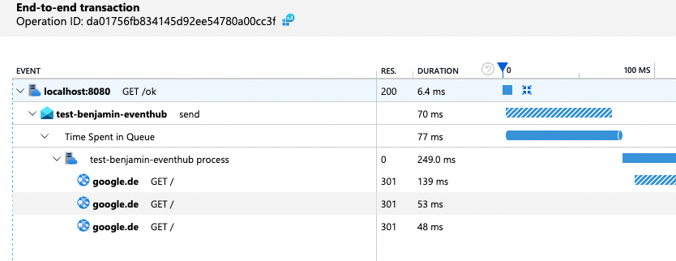
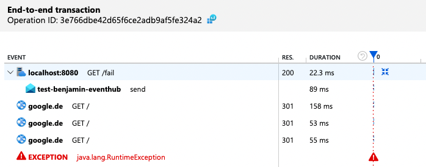
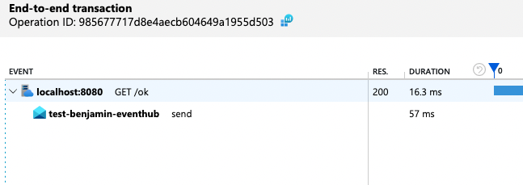
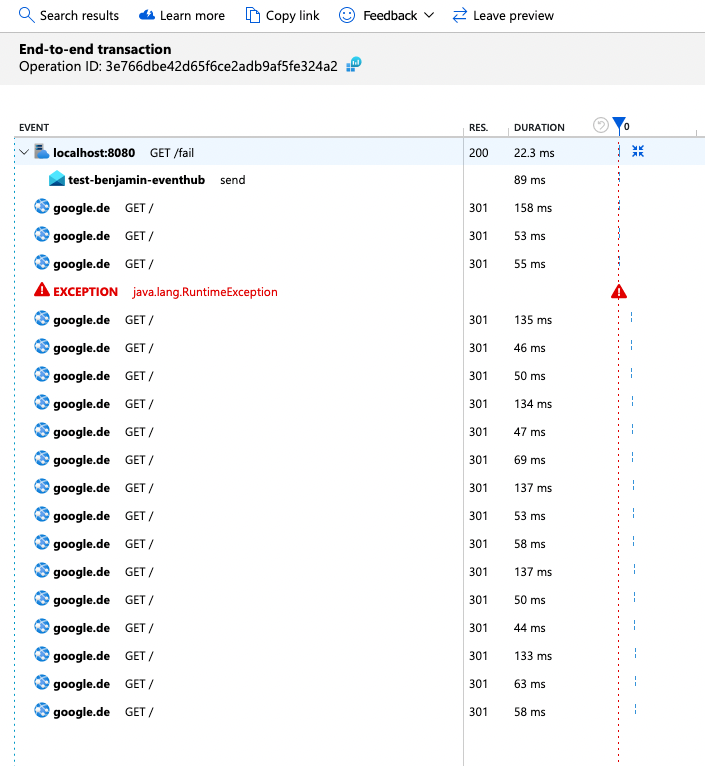
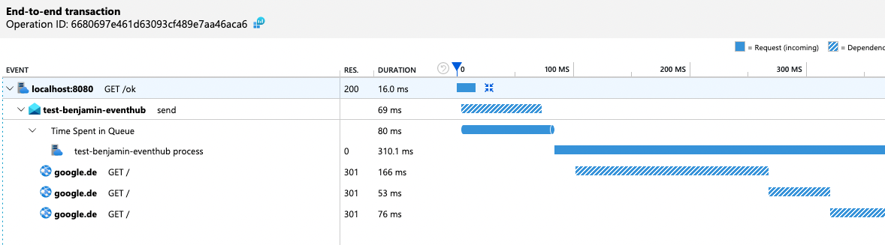
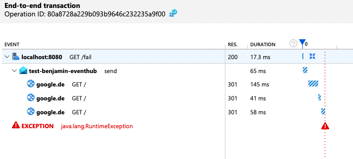
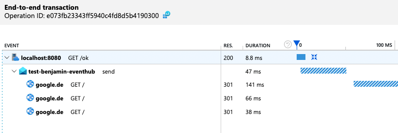

# AppInsights Otel Kafka Issue

This repo reproduces an issue with Open Telemetry, Azure Application Insights, Azure Eventhubs and a Kafka client. 

I've tested this with the current 3.3.0-BETA of the Application Insights Java Agent. You can set the `applicationinsights-agent.version` property in the pom.xml in the root folder if you want to try it yourself.

It consists of two services:
1. A REST service that exposes two interfaces: "GET /ok" and "GET /fail". It will send an event to an eventhub with either a "ok" or "fail" payload depending on the called interface.
2. A consumer service that consumes the events. It will do three GET requests to google to mock some business process. After that it will throw an exception if the received payload from the event is the string "fail". 

## Building & running the services

You need Java 17, Docker and docker-compose.

Additional requirements in azure:
- An Application Insights 
- An Eventhub namespace
- An Eventhub in that namespace
  - Two shared access keys for that Eventhub

Building and running:

- `./mvnw clean install`
- `export APPLICATIONINSIGHTS_CONNECTION_STRING="<your application insights connection string>" `
- `export EVENTHUB_NAMESPACE_NAME=<name of the eventhub namespace>`
- `export EVENTHUB_PRODUCER_CONNECTION_STRING="<connection string to a eventhub shared access key>"`
- `export EVENTHUB_CONSUMER_CONNECTION_STRING="<connection string to a eventhub shared access key>"`
- `docker-compose up`

examples:
- `export APPLICATIONINSIGHTS_CONNECTION_STRING="InstrumentationKey=xxxxxxx;IngestionEndpoint=https://westeurope-2.in.applicationinsights.azure.com/;LiveEndpoint=https://westeurope.livediagnostics.monitor.azure.com/" `
- `export EVENTHUB_NAMESPACE_NAME=test-benjamin-eventhub-2-ns`
- `export EVENTHUB_PRODUCER_CONNECTION_STRING="Endpoint=sb://xxxxx.servicebus.windows.net/;SharedAccessKeyName=producer;SharedAccessKey=xxxx=;EntityPath=test-benjamin-eventhub"`
- `export EVENTHUB_CONSUMER_CONNECTION_STRING="Endpoint=sb://xxxxx.servicebus.windows.net/;SharedAccessKeyName=consumer;SharedAccessKey=xxxxx/xxxx=;EntityPath=test-benjamin-eventhub"`

## The issue

When an exception is thrown during consumption of an event all traces after that, coming from that consumer service, will stick to one context (traceparent/operationId).

How to reproduce:

1. If the "/ok" endpoint is called the trace in application insights looks like this. Everything looks fine: <br />


2. The "/fail" interface is called and looks like this. Queue time and process entries are missing. Wrong indentation because parent-ids are not found: <br />


3. All subsequent "/ok" calls now look like this. They are missing all entries from the consumer <br />


4. All missing entries now end up in the trace of step 2: <br /> 

   
5. After restarting the services everything is back to normal until the exception is thrown again. 


## The workaround

A workaround we have found is that you could extract the "traceparent" header from the event inside the consumer and make this the current trace context.

After a restart the "/ok" traces now look like this. Mind the wrong indentation:



When the "/fail" endpoint is called the trace looks a bit better. The exception is out of place because the parent is missing: 



The subsequent "/ok" request also look better, but they are missing the queue time information:




Polling without the workaround:
```java
  private void pollMessages(Consumer<Long, String> kafkaConsumer) {
    try {
      while (true) {
        try {
          final ConsumerRecords<Long, String> consumerRecords = kafkaConsumer.poll(Duration.ofMillis(1000));
          for(ConsumerRecord<Long, String> cr : consumerRecords) {
            log.error("Consumer Record:({}, {}, {}, {})", cr.key(), cr.value(), cr.partition(), cr.offset());

            log.info("Headers:");
            for (Header header : cr.headers()) {
              log.info("Key: {}, Value: {}", header.key(), new String(header.value()));
            }
            
            exampleEventConsumer.accept(cr.value());
          }
          kafkaConsumer.commitAsync();
        } catch (Exception e) {
          log.error("got some error: ", e);
        }
      }
    } catch (CommitFailedException e) {
      log.error("CommitFailedException", e);
    } finally {
      kafkaConsumer.close();
    }
  }
```

With the workaround:

```java
  private void pollMessages(Consumer<Long, String> kafkaConsumer) {
    try {
      while (true) {
        try {
          final ConsumerRecords<Long, String> consumerRecords = kafkaConsumer.poll(Duration.ofMillis(1000));
          for(ConsumerRecord<Long, String> cr : consumerRecords) {
            log.error("Consumer Record:({}, {}, {}, {})", cr.key(), cr.value(), cr.partition(), cr.offset());

            log.info("Headers:");
            for (Header header : cr.headers()) {
              log.info("Key: {}, Value: {}", header.key(), new String(header.value()));
            }
            // with workaround
            Context context = getTraceParent(cr);
            try (Scope scope = context.makeCurrent()) {
              exampleEventConsumer.accept(cr.value());
            }
          }
          kafkaConsumer.commitAsync();
        } catch (Exception e) {
          log.error("got some error: ", e);
        }
      }
    } catch (CommitFailedException e) {
      log.error("CommitFailedException", e);
    } finally {
      kafkaConsumer.close();
    }
  }

  /**
   * Get trace context from consumer record
   */
  private Context getTraceParent(ConsumerRecord<Long, String> consumerRecord) {
    var textMapGetter = new TextMapGetter<ConsumerRecord<Long, String>>() {
      @Override
      public Iterable<String> keys(ConsumerRecord carrier) {
        return Collections.singleton("traceparent");
      }

      @Override
      public String get(ConsumerRecord carrier, String key) {
        Header header = carrier.headers().lastHeader(key);
        return header == null ? null : new String(header.value(), StandardCharsets.UTF_8);
      }
    };

    return W3CTraceContextPropagator
        .getInstance()
        .extract(Context.root(), consumerRecord, textMapGetter);
  }
```